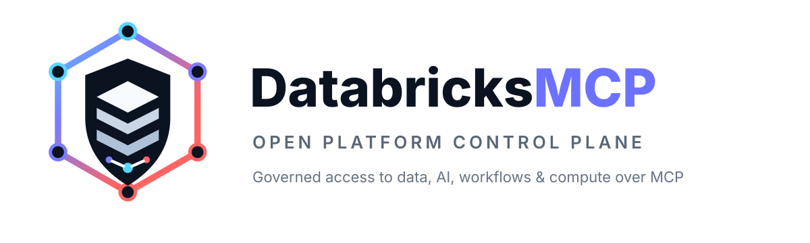
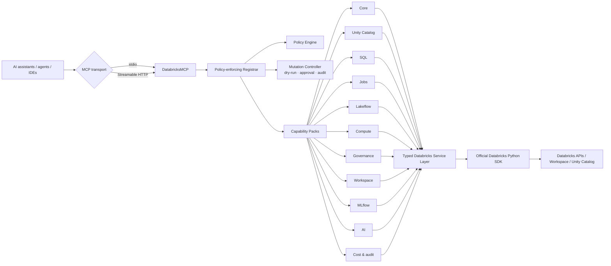

<p align="center">
  
</p>

<p align="center">
  <strong>The open, policy-first MCP control plane for Databricks.</strong><br>
  Governed access to data, SQL, workflows, compute, workspace assets, governance, ML/AI, and cost through one extensible Model Context Protocol server.
</p>

<p align="center">
  <a href="../../actions/workflows/ci.yml"></a>
  
  
  
  
</p>

---

# DatabricksMCP

Most data MCP demos stop at **“let the model run a query.”**

DatabricksMCP is being built for a different target: a **broad, governable, self-hostable platform gateway** that lets AI assistants and agents inspect and operate a Databricks environment without bypassing security, policy, or operational controls.

Today the project exposes **63 read tools across 11 capability packs** — Unity Catalog, SQL, Jobs, Lakeflow pipelines, compute, governance, workspace assets, MLflow, AI (Model Serving, Vector Search, Genie), and cost/audit — plus a **controlled-mutation contract** with a first gated write pack.

> [!IMPORTANT]
> DatabricksMCP is pre-1.0 and under active development. The read surface is always on. **State-changing tools are disabled by default**; when enabled they are gated per-tool, and destructive actions require an approval token and are audited (see [Controlled mutations](#controlled-mutations)). Remote deployments still require additional authentication and transport hardening before internet exposure.

> [!NOTE]
> DatabricksMCP is an independent open-source community project. It is not affiliated with, endorsed by, or sponsored by Databricks, Inc. Databricks and related marks are trademarks of their respective owners.

## Why DatabricksMCP?

A production-oriented MCP server for an enterprise data platform needs more than API wrappers.

DatabricksMCP is designed around five principles:

- **Policy before capability** — every tool is registered with explicit operational metadata and passes a central policy gate.
- **Bounded by default** — list operations, SQL results, bytes, wait time, and warehouse access can be constrained.
- **Credentials stay out of prompts** — Databricks unified authentication is used instead of accepting secrets as model-generated tool arguments.
- **Platform-wide, not SQL-only** — one server can expose governed context from catalog, compute, workflows, governance, workspace, ML/AI, and cost services.
- **Extensible by domain** — capability packs isolate platform surfaces so new functionality does not turn the server into one monolithic tool module.

## Current capability map

| Capability pack | Tools | Current coverage |
|---|---:|---|
| **Core** | 5 | Health, identity, server introspection, enabled capabilities, policy status |
| **Unity Catalog** | 12 | Catalogs, schemas, tables, views, columns, functions, volumes |
| **Databricks SQL** | 7 | Warehouses, query history, guarded SQL, EXPLAIN, polling, cancellation |
| **Jobs** | 5 | Jobs, runs, run details, run output |
| **Lakeflow Pipelines** | 5 | Pipelines, events, updates, update details |
| **Compute** | 7 | Clusters, events, policies, node types, Runtime versions |
| **Governance** | 3 | Direct/effective UC grants and workspace object permissions |
| **Workspace** | 3 | Browse workspace objects, inspect status, export notebooks/files |
| **MLflow** | 6 | Experiments, runs, registered models, model versions |
| **AI** | 8 | Model Serving endpoints, Vector Search endpoints & indexes, Genie spaces |
| **Cost & audit** | 2 | Recent `system.billing.usage` and `system.access.audit` reads |
| **Total** | **63** | **11 capability packs** |

Enabling `controlled-write` adds a gated **jobs write** pack (`run_job`, `cancel_job_run`, `delete_job`), off by default.

<details>
<summary><strong>View the full tool inventory</strong></summary>

### Core
`health` · `server_info` · `list_enabled_capabilities` · `get_policy_status` · `current_identity`

### Unity Catalog
`list_catalogs` · `get_catalog` · `list_schemas` · `get_schema` · `list_tables` · `list_views` · `get_table` · `describe_table` · `list_columns` · `list_functions` · `get_function` · `list_volumes`

### Databricks SQL
`list_sql_warehouses` · `get_sql_warehouse` · `list_query_history` · `execute_read_only_sql` · `explain_sql` · `get_sql_statement` · `cancel_sql_statement`

### Jobs
`list_jobs` · `get_job` · `list_job_runs` · `get_job_run` · `get_job_run_output`

### Lakeflow Pipelines
`list_pipelines` · `get_pipeline` · `list_pipeline_events` · `list_pipeline_updates` · `get_pipeline_update`

### Compute
`list_clusters` · `get_cluster` · `list_cluster_events` · `list_cluster_policies` · `get_cluster_policy` · `list_node_types` · `list_spark_versions`

### Governance
`get_grants` · `get_effective_grants` · `get_permissions`

### Workspace
`list_workspace_objects` · `get_workspace_status` · `export_notebook`

### MLflow
`list_experiments` · `get_experiment` · `search_experiment_runs` · `list_registered_models` · `get_registered_model` · `get_model_version`

### AI
`list_serving_endpoints` · `get_serving_endpoint` · `list_vector_search_endpoints` · `get_vector_search_endpoint` · `list_vector_search_indexes` · `get_vector_search_index` · `list_genie_spaces` · `get_genie_space`

### Cost & audit
`get_recent_billing_usage` · `get_recent_audit_events`

### Jobs — controlled-write (opt-in, off by default)
`run_job` · `cancel_job_run` · `delete_job`

</details>

## Architecture



The MCP layer is intentionally thin. Tool implementations delegate to a testable service layer, while the registrar applies policy checks consistently before a capability executes, and routes every mutation through a single safety contract.

## Safety model

DatabricksMCP treats model-generated tool input as untrusted.

### SQL guardrails

`execute_read_only_sql` parses SQL with the Databricks dialect using `sqlglot` and rejects requests unless they are positively recognized as permitted query forms.

Current protections include:

- single-statement enforcement;
- deny-by-default AST validation;
- DML/DDL/administrative command rejection;
- nested command checks;
- bounded rows;
- bounded response bytes;
- bounded synchronous wait time;
- optional SQL warehouse allowlist;
- statement polling and cancellation.

### Controlled mutations

State-changing tools are **off by default**. They register only when `DATABRICKS_MCP_ACCESS_MODE=controlled-write`, and each one executes only if its name is in `DATABRICKS_MCP_WRITE_TOOLS_ALLOW`. Every mutation routes through one contract:

`policy → dry-run plan → approval → execute → audit`

- **Dry-run** — call any write tool with `dry_run=true` to get a plan (risk, target, argument fingerprint) without executing.
- **Approval** — destructive and privileged actions require a short-lived, **single-use** token bound to the exact tool and arguments; a dry-run returns the token. Wrong-argument, wrong-tool, expired, and replayed tokens are rejected.
- **Audit** — every branch (denied, dry-run, approval-required, executed, error) emits a structured event that never contains argument values.

The first gated pack is jobs (`run_job`, `cancel_job_run`, `delete_job`). See [`docs/adr/0002-mutation-safety-contract.md`](docs/adr/0002-mutation-safety-contract.md).

### Authentication

Databricks credentials are resolved through **Databricks unified authentication**.

Recommended production identities include:

- OAuth machine-to-machine credentials;
- workload identity federation;
- short-lived identity-based credentials.

Credentials should never be supplied as MCP tool arguments or embedded in prompts.

### Threat-model assumptions

The MCP client, MCP server, identity provider, Databricks control plane, and telemetry/policy backends are separate trust boundaries.

The project assumes:

- authenticated users can still send malicious or prompt-injected input;
- “read-only” data can still be sensitive;
- a read operation can still create substantial compute cost;
- an MCP session identifier is not an authorization boundary;
- inbound MCP authorization and upstream Databricks authorization must remain separate concerns.

See [`SECURITY.md`](SECURITY.md) and [`docs/threat-model.md`](docs/threat-model.md).

## Quick start

### Requirements

- Python 3.11+
- a Databricks workspace
- Databricks unified authentication configured locally

### Development install

```bash
uv sync --all-groups
uv run databricks-mcp
```

### Local MCP client

```json
{
  "mcpServers": {
    "databricks": {
      "command": "uv",
      "args": [
        "run",
        "--directory",
        "/absolute/path/to/DatabricksMCP",
        "databricks-mcp"
      ]
    }
  }
}
```

### Streamable HTTP

```bash
export DATABRICKS_MCP_TRANSPORT=streamable-http
export DATABRICKS_MCP_HOST=127.0.0.1
export DATABRICKS_MCP_PORT=8000

uv run databricks-mcp
```

The MCP endpoint is `/mcp`.

> [!WARNING]
> Do not expose the current HTTP server directly to the public internet. Put it behind TLS and a standards-compliant authentication layer until native remote MCP authorization is implemented.

## Configuration

| Variable | Default | Purpose |
|---|---:|---|
| `DATABRICKS_MCP_TRANSPORT` | `stdio` | `stdio` or `streamable-http` |
| `DATABRICKS_MCP_HOST` | `127.0.0.1` | HTTP bind address |
| `DATABRICKS_MCP_PORT` | `8000` | HTTP bind port |
| `DATABRICKS_MCP_LOG_LEVEL` | `INFO` | Log level |
| `DATABRICKS_MCP_ACCESS_MODE` | `read-only` | `read-only` or `controlled-write` |
| `DATABRICKS_MCP_WRITE_TOOLS_ALLOW` | unset | Comma-separated write tools to enable (controlled-write only) |
| `DATABRICKS_MCP_APPROVAL_TTL_SECONDS` | `300` | Approval-token lifetime for destructive actions (30–3600) |
| `DATABRICKS_MCP_DEFAULT_PAGE_SIZE` | `100` | Default bounded listing size |
| `DATABRICKS_MCP_SQL_MAX_ROWS` | `1000` | SQL result-row ceiling |
| `DATABRICKS_MCP_SQL_BYTE_LIMIT` | `10000000` | SQL result-byte ceiling |
| `DATABRICKS_MCP_SQL_WAIT_SECONDS` | `30` | Initial SQL wait before polling |
| `DATABRICKS_MCP_SQL_WAREHOUSES` | unset | Optional comma-separated warehouse allowlist |

Standard `DATABRICKS_*` authentication variables are consumed by the official Databricks SDK.

## What “production-grade” means for this project

The goal is not simply to accumulate more tools. The goal is to make broad platform access **safe enough to operate in enterprise environments**.

The production-readiness backlog is therefore centered on:

### 1. Remote identity and isolation
- native MCP OAuth 2.1 protected-resource support;
- audience-bound token validation;
- no token passthrough;
- user-to-Databricks identity mapping;
- M2M, U2M, OBO, and workload identity patterns;
- multi-user and multi-workspace isolation.

### 2. Policy as a first-class subsystem
- multidimensional policy: effect, sensitivity, privilege, cost, external side effects;
- pack/tool/catalog/schema/table/path allowlists and denylists;
- tag-aware access policies;
- per-tool scopes;
- **approval policies for privileged actions** (implemented for mutations);
- **policy decision audit records** (implemented).

### 3. MCP-native contracts
- explicit output schemas and structured content (implemented);
- MCP tool annotations (`readOnlyHint`, `destructiveHint`, `idempotentHint`, `openWorldHint`);
- Resources for schemas, notebooks, lineage, and other context-heavy objects;
- `_meta` for deterministic execution settings such as warehouse selection and output limits;
- cursor pagination;
- task-based execution for long-running operations.

### 4. Observability and enterprise operations
- OpenTelemetry traces, metrics, and logs;
- audit sinks;
- request/correlation IDs;
- quotas, concurrency controls, and distributed rate limiting;
- per-user/tool/workspace usage metrics;
- cost budgets and kill switches;
- health/readiness probes.

### 5. Controlled mutations
The core contract — `policy → dry-run → approval → audit` — is implemented and gates the first write pack. The remaining work is depth:

`plan → policy evaluation → dry run → human/automation approval → idempotent execution → audit → rollback/compensation`

- idempotency-key store;
- rollback/compensation;
- write packs for pipelines, compute, warehouse lifecycle, and governed file writes.

## Platform expansion

The architecture is intended to grow beyond the current 63-tool read surface.

High-value capability packs include:

- **Lineage & governance** — table/column lineage, tags, ownership, policies (grants/permissions and system-table audit already shipped);
- **SQL intelligence** — query profiles, dashboards, alerts, saved queries, cost diagnostics;
- **Lakehouse platform** — external locations, storage credentials, connections, shares, recipients;
- **ML & AI** — deeper Model Serving, feature engineering, and agent tooling (serving, Vector Search, and Genie already shipped);
- **Cost & FinOps** — warehouse/cluster spend and optimization recommendations (billing/usage reads already shipped);
- **Account administration** — users, groups, service principals, workspaces, account-level governance;
- **Controlled operations** — job/pipeline runs, compute lifecycle, warehouse lifecycle, governed file writes (jobs run/cancel/delete already shipped);
- **Extension SDK** — third-party capability packs without modifying the core server.

## Development

```bash
uv sync --all-groups

uv run ruff check .
uv run ruff format --check .
uv run mypy src
uv run pytest
```

The project uses strict typing, automated formatting/linting, tests with coverage gates, dependency automation, CodeQL, and a non-root container image.

## Contributing

Contributions are welcome.

Before adding a capability, ask:

1. What Databricks permission does it require?
2. Can the operation expose sensitive data?
3. Can it change state?
4. Can it create material cost?
5. Can its output be bounded?
6. Does it need dry-run, approval, idempotency, or rollback?
7. Can it be tested without a live workspace?

Read [`CONTRIBUTING.md`](CONTRIBUTING.md) and [`SECURITY.md`](SECURITY.md) before opening a pull request.

## Roadmap

See [`ROADMAP.md`](ROADMAP.md) for capability and quality gates.

The long-term target is a stable 1.0 with:

- broad Databricks platform coverage;
- enterprise remote authorization;
- multi-tenant isolation;
- audited controlled mutations;
- stable schemas and compatibility guarantees;
- signed releases, SBOM/provenance, PyPI and container distribution;
- MCP Registry publication;
- a public extension SDK.

## License

Apache License 2.0.
